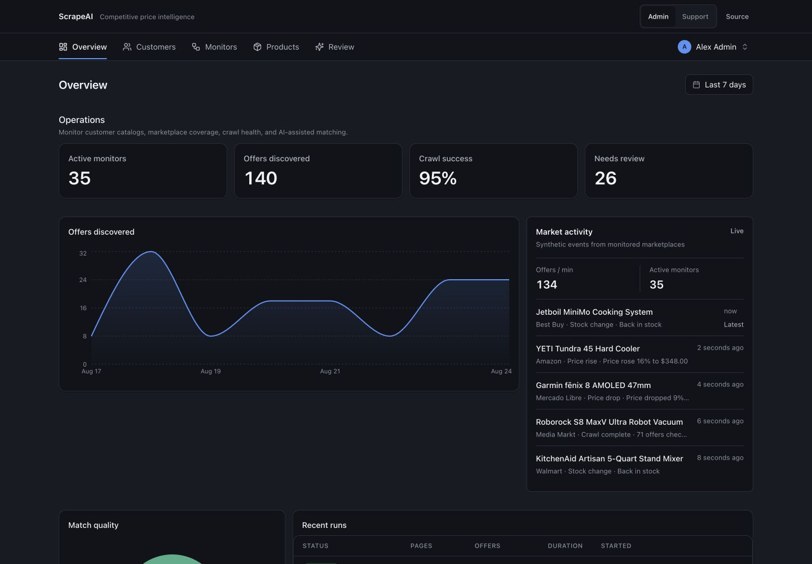

# ScrapeAI — the canonical FlowPanel demo

ScrapeAI is a fictional **Competitive price intelligence** SaaS. Customers connect product
catalogs and marketplace monitors; ScrapeAI discovers competing offers, matches them to catalog
products, and sends uncertain results to a human Review workflow.

This example is the reference for building a production-shaped admin with FlowPanel, Next.js,
Drizzle, and PostgreSQL. The main journey uses seven screens and the public FlowPanel DSL directly:
no generated page tree, config meta-framework, runtime crawler, or external AI call.



## Run locally

Prerequisites: Node.js 22+, pnpm, and Docker.

```bash
pnpm install
pnpm --filter "./packages/**" build
pnpm --filter ai-scraper docker:up
pnpm --filter ai-scraper db:push
pnpm --filter ai-scraper db:seed
pnpm --filter ai-scraper dev
```

Open [http://localhost:3000](http://localhost:3000), then choose **Open admin**. The default local
mode is interactive. Use the Admin / Support switch to see server-enforced role differences.
The in-app persona guide points to Products and Customers, where the Support role loses the
admin-only pricing field and destructive disable action while retaining routine operations.

## Seven-screen tour

**Overview** turns operational data into a concise status page: active monitors, offers found,
crawl success, the Review backlog, marketplace activity, live throughput, and recent runs. The date
range changes time-based metrics and charts; each summary links to its underlying resource.

**Customers** manages the SaaS accounts that own catalogs and monitors. Search and filter the
table, edit Company inline, import or export data, open related Monitors, Products, and Invoices in
the drawer, and compare the Admin-only disable action with the Support persona.

**Monitors** shows where and how ScrapeAI crawls marketplaces for each customer. Typed forms
validate target URLs, filters expose schedule and status, bulk actions pause or resume work, and the
drawer connects a monitor to its recent Runs and discovered Offers.

**Runs** is the operational history of every crawl. It keeps status, throughput, duration, retry,
related Offers, and AI usage together without making operators reconstruct a run from raw tables.

**Offers** is the live marketplace dataset discovered by those runs. It demonstrates full-text
search, faceted and numeric filters, stock and rating formats, export, and a drawer that connects
each marketplace offer to its AI match.

**Products** is each customer's own catalog. It demonstrates explicit grouped forms, searchable
customer references, category filters, money formatting, field-level RBAC, export, and related AI
matches without exposing raw foreign-key IDs to operators.

**Review** is the human-in-the-loop core. Ambiguous product/offer matches appear lowest-confidence
first with saved views and Confirm / Reject actions; the drawer keeps the decision, marketplace
offer, and catalog product together. Invoices and AI usage remain available through drawers without
crowding primary navigation with implementation-level datasets.

## Feature-to-code map

| Capability | Canonical source |
| --- | --- |
| Complete admin composition, auth, security, theme | `src/admin/config/index.ts` |
| Customers, Monitors, Runs, Offers, Products, Review resources | `src/admin/config/resources/` |
| Operational dashboard composition | `src/admin/config/overview.ts` |
| Named, testable dashboard queries | `src/admin/overview-queries.ts` |
| One accessible live-operations widget | `src/admin/LiveOperations.tsx` |
| Bounded synthetic SSE feed | `src/demo/realtime/feed.ts` |
| Six coherent customer/product stories | `src/demo/data/scenarios.ts` |
| Deterministic relational data generator | `src/demo/data/generate.ts` |
| Disposable demo personas | `src/demo/auth/` |
| Drizzle tables and relations | `src/db/schema.ts` |
| Transactional sandbox seed and reset | `src/demo/sandbox/seed.ts` |
| Next.js admin page and API handlers | `app/admin/` and `app/api/flowpanel/` |

The `src/admin` directory is deliberately copyable application code. Synthetic identities, data,
and realtime simulation live under `src/demo`, making the boundary between FlowPanel usage and
showcase infrastructure explicit.

## Data model and reset

The seed creates 48 customers, 36 monitors, 60 catalog products, 252 crawl runs, and 240 offers
with matching decisions. Six named customer stories provide recognizable products and believable
ambiguous variants; background rows add enough volume for pagination, filters, charts, and saved
views. Ownership and timestamps are generated as one causal graph, and exactly 26 matches begin in
`needs_review`.

`pnpm --filter ai-scraper db:seed` idempotently creates the stable `local` sandbox. It never
rewrites another sandbox. Reset one target explicitly with
`pnpm --filter ai-scraper demo:reset -- --sandbox local`; remove expired browser sandboxes with
`pnpm --filter ai-scraper demo:cleanup -- --force`.

## Public demo safety

Set `DEMO_MODE=true` and a random 32+ character `DEMO_SANDBOX_SECRET` for a public deployment. Each
browser gets a private, pre-populated PostgreSQL sandbox: create, edit, delete, actions, reloads,
references, exports, and dashboards all stay inside that database-enforced scope. Inactivity
expires after 60 minutes and absolute lifetime is 24 hours. A visitor can reset only their own
sandbox; reset is atomic and rate-limited. Public bulk import is disabled to bound amplification,
while ordinary creates remain available.

The active-sandbox cap defaults to 200 and creation throttling to 10 per IP-HMAC per hour. Set
`DEMO_TRUST_PROXY=true` only behind a reverse proxy that replaces forwarding headers; otherwise the
server deliberately uses one conservative unknown fingerprint bucket. Raw client IPs are never stored.
Lazy PostgreSQL-coordinated cleanup runs at most every 15 minutes, and `demo:cleanup` is available
for cron/observability. Set `DEMO_READ_ONLY=true` to remove mutation affordances and reject direct
writes during an incident. Hiding controls is never the security boundary.

The persona cookie is an unsigned, allow-listed demo mechanism only—replace all of `src/demo/auth`
with trusted application auth in a real product.

The example also enables role checks, audit events, and in-memory IP rate limiting. The realtime
feed never writes to PostgreSQL and never calls marketplaces or an LLM. Set `DEMO_LIVE=off` on
serverless hosts where a persistent two-second ticker is inappropriate.

Never deploy the sample `.env` values as secrets. Configure `DATABASE_URL` and your real auth,
audit sink, shared rate-limit store, and network policy for production.

## Optional queues

With no `REDIS_URL`, the demo starts cleanly and queue screens are absent. To exercise BullMQ:

```bash
docker run -d -p 6379:6379 redis:7-alpine
export REDIS_URL=redis://localhost:6379
export BOARD_TOKEN=$(openssl rand -hex 16)
pnpm --filter ai-scraper flowpanel:board
pnpm --filter ai-scraper dev
```

Queue routes stay out of primary navigation. When Redis is configured, the Live operations header
links to the queue boards, and each board exposes the other configured queues as contextual tabs.
`BOARD_TOKEN` is mandatory because the separate board origin exposes destructive job controls. Set
`BOARD_URL` to a browser-reachable HTTPS origin when deployed.

## Deploy

Build from the repository root with the included Dockerfile, attach PostgreSQL, and set
`DATABASE_URL`, `DEMO_MODE=true`, and `DEMO_SANDBOX_SECRET`. The container applies the schema and
starts; it does not globally seed on restart. Browser sandboxes are populated lazily. A persistent
Node host supports Live operations; on Vercel or another sleeping serverless runtime, set
`DEMO_LIVE=off`.

The browser-sandbox schema replaces the shared demo schema used before this release. Because every
row in this example is synthetic, that one upgrade is intentionally a fresh-database deployment,
not an in-place data migration. Recreate the local demo volume before the first upgraded start:

```bash
docker compose -f examples/ai-scraper/docker-compose.demo.yml down --volumes
```

For a hosted demo, retain the old database only as an archive and point the new release at a fresh
database. Subsequent starts use `db:push` against the sandbox schema without clearing live browser
sandboxes. Do not use this demo deployment workflow for application data that must be retained.

```bash
docker build -f examples/ai-scraper/Dockerfile .
DEMO_SANDBOX_SECRET="$(openssl rand -hex 32)" \
  docker compose -f examples/ai-scraper/docker-compose.demo.yml up --build
```

The result is a standard Next.js application. Railway, Fly.io, Coolify, and comparable Node hosts
work with any PostgreSQL-compatible managed database.
